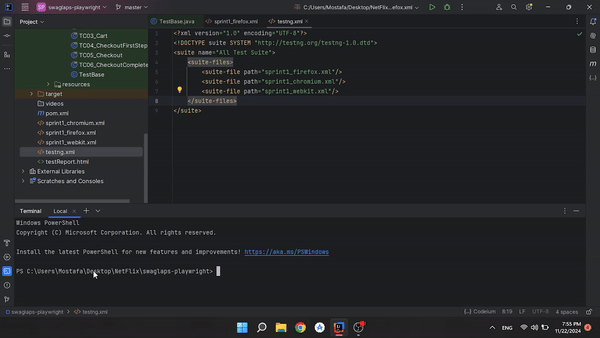

# Swag Labs Test Automation

## Table of Contents

- [Introduction](#introduction)
- [Features](#features)
- [Objectives](#Objectives)
- [Scope](#Scope)
- [Test environment](#Environment)
- [Installation](#installation)
- [Usage](#usage)
- [Contributing](#contributing)
- [License](#license)

## Introduction

This document outlines the automation testing plan for the Swag Labs using playwright, a web application for shopping.

## Features

- *Account*: Login to the application.
- *Cart*: Add and remove products from the cart.
- *Order*: Return back to continue shopping or submit the order.

## Objectives
The objectives of automation testing for the Swag Labs are as follows:
- To ensure that the Swag Labs application is stable and reliable.
- To increase the speed of testing and reduce manual effort. 
- To reduce the overall cost of testing. 
- To ensure that all items added to cart are going to checkout. 
- To ensure that the prices are correct.

## Scope
The scope of automation testing includes:
- Functional testing of all modules.
- Regression testing of all modules.

## Environment
The test environment for automation testing is as follows:
- Browser: chromium
- Browser: Mozilla Firefox
- Browser: webkit
- Programming language: Java

## Installation

To set up the Swag Labs application locally, follow these steps:

1. Clone the repository:
*   git clone https://github.com/Darshfb/swaglabs-playwright
2. Navigate to the project directory:
*   cd swaglabs-playwright
3. Install dependencies:
*   npm install
4. Configure the application:

* Update configuration files with necessary settings.
5. Run the application:
*   mvn verify clean

## Usage
* User Guide: Refer to the User Guide for detailed information on how to use the Swag Labs website.

### Local testing execution example

## Contributing
* We welcome contributions from the community. To contribute to Swag Labs, follow these steps:

## Fork the repository.
* Create a new branch for your feature or bug fix.
* Make your changes and submit a pull request.

## License
* Swag Labs project is licensed under the MIT License.